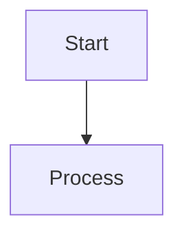

# Course Cheat Sheet

## Essential formulas

- 

## Definitions

- 

## Diagrams

## Comparison table

| Item | Use when | Watch out |
| --- | --- | --- |
|  |  |  |

## Procedures

1. 

## Common mistakes

- 
